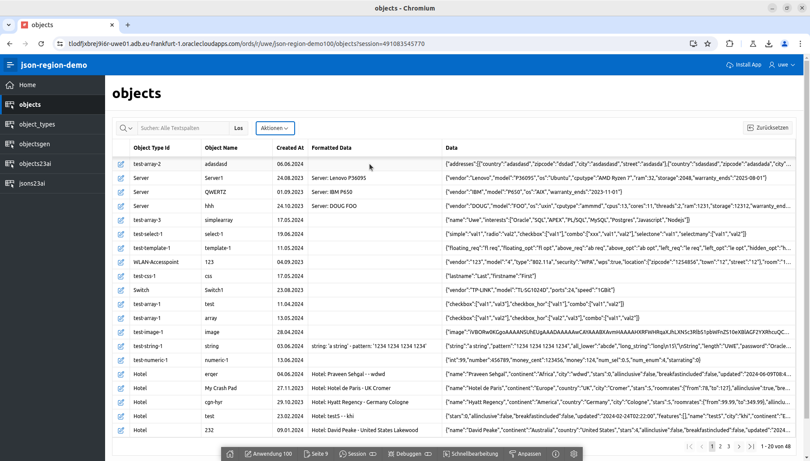

# JSON-item-display

An Oracle-APEX-plugin which formats JSON-data using a format template containing JSON-path-expressions.

The main usecase are lists (interactive grids) with columns containing formated JSON-data depending on an object-type.

The description of the output format is a string containing simple JSON-path-expressions exclosed by **#**.

## Example

For JSON-data
```JSON
{
  "lastname":  "Simon",
  "firstname": "Uwe",
  "address": {
    "country":   "Germany",
    ....
  },
  ...
}

```
the format
```
  User: #$.lastname#, #$firstname# Country: #$.address.country#" 
```
returns the string
```
  User:  Simon, Uwe Country: Germany
```
The format could be part of the JSON-schema describing the JSON-data.
```JSON
{
  "type": "object",
  "properties": {

  },
  "apex": {
    "display": {
      "default": "#$.lastname#, #$.firstname#",
      "detail": "#$.lastname#, #$.firstname#, #$.address.country#, #$.address.city#",
    }
  } 
}
```
The JSON-schema can contain several output-formats used in different lists/interactive grids, 


## Configuration
The JSON-item-display-plugin can be used as 
- page-item
- interactive-grid-column, the plugin must be an additional column. For performance reasons a variable JSON-schema must be contained in a hidden grid-column. 

When configuring the JSON-item-display-plugin, the output format can be defined by
- **Fixed format**: The format string, configured in Page-designer 
- **Static schema**: A fixed schema, configured in Page-designer
- **SQL-Query**: A schema, selected by a SQL-query
- **Page-item**: The schema is located in a page item. When the plugin is used in an interactive-grid-column, this could be another column. 

